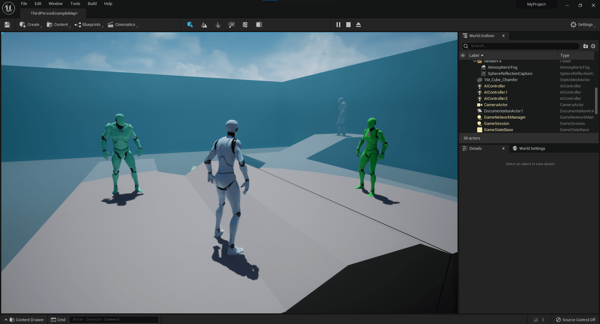
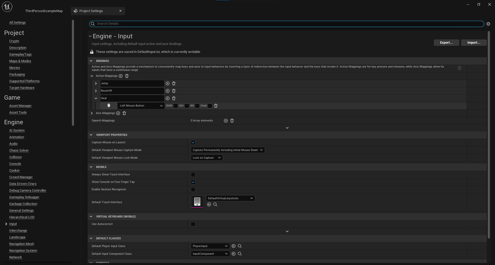
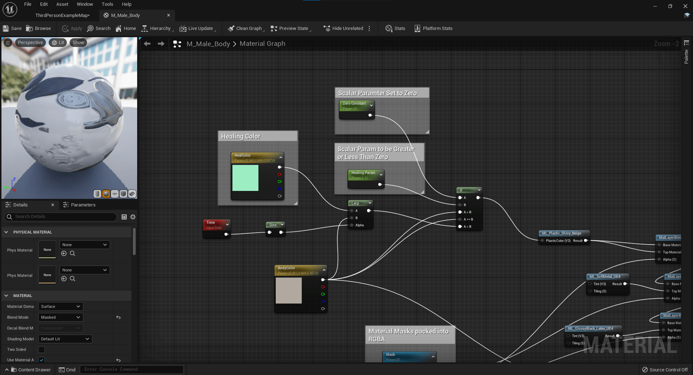
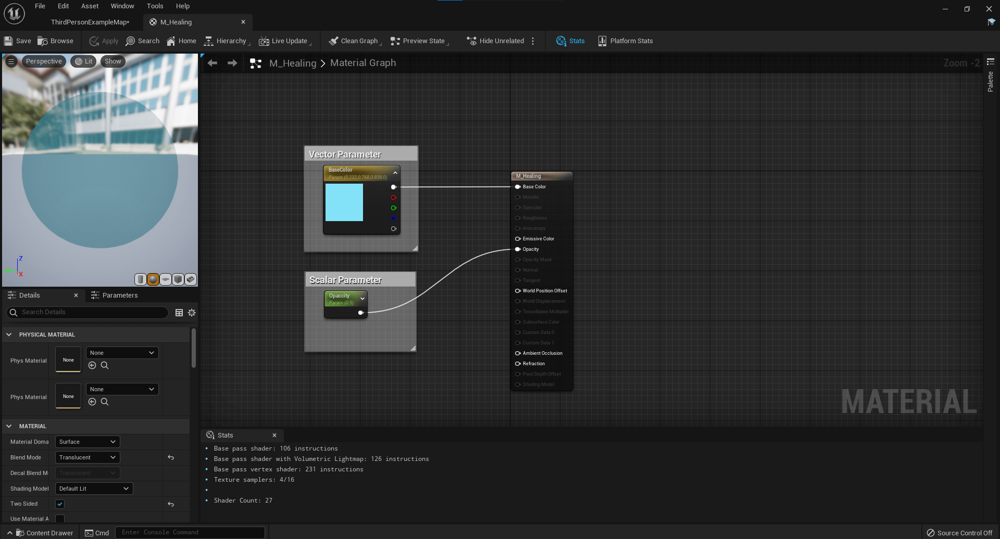
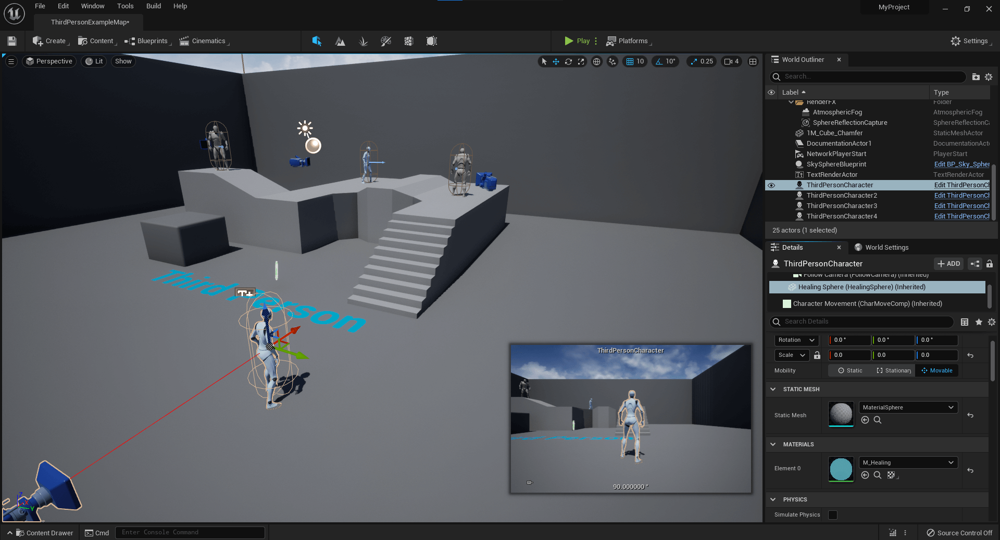
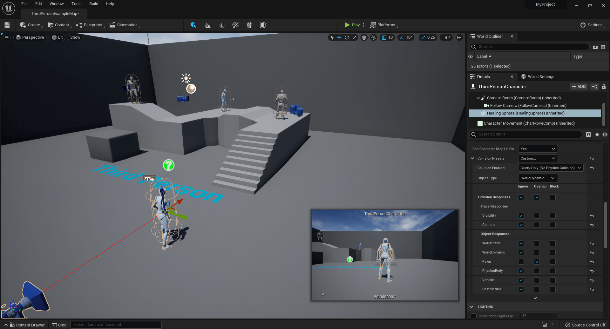

# Heal Other Players Using OnComponentBeginOverlap
* Unreal Version: **5.0.0**
* Template: **Third Person**
* Project Name: **MyProject**



In this example the player will create a sphere by holding the left mouse button and every character that overlaps the sphere will trigger their heal method. The characters healing will have their material pulsate green.This example is a little weird, character's don't actually have health that increases, but it has a lot of useful snippets that I think can help in the future or be extended.

## Some of the things the code uses.
* UMaterialInstanceDynamic
* OnComponentBeginOverlap
* Cast to Character type
* SetScalarParameterValue
* SetWorldScale3D
* Update inputs

1. Add an input method. I added an Input action called `Heal` and bound it to the left mouse button. *Edit->Project Settings->Input*


2. Update the M_Male_Body Material to have an if statement. See image below *Content/Mannequin/Character/Materials/M_Male_Body*



3. Create A new material to use for the healing sphere or use whatever you want. I made a simple translucent material, see image below



4. Add other ThirdPersonCharacter Blueprints to your Scene. *Content->ThirdPersonCPP->Blueprints->ThirdPersonCharacter

5. After the code compiles add the sphere mesh and material to the player character.



6. Update the sphere's collision presets to only overlap Pawns.



## Notable Line Changes

**MyProjectCharacter.h**
* lines 9-10
* lines 38-65

**MyProjectCharacter.cpp**
* lines 11-12
* lines 51-72
* lines 84-85
* lines 169-240


## Helpful Links

* [OnComponentBeginOverlap](https://docs.unrealengine.com/4.26/en-US/API/Runtime/Engine/Components/UPrimitiveComponent/OnComponentBeginOverlap/)
* [FComponentBeginOverlapSignature](https://docs.unrealengine.com/4.26/en-US/API/Runtime/Engine/Components/FComponentBeginOverlapSignature/)
* [UMaterialInstanceDynamic](https://docs.unrealengine.com/4.26/en-US/API/Runtime/Engine/Materials/UMaterialInstanceDynamic/)
* [GetMaterial](https://docs.unrealengine.com/4.26/en-US/API/Runtime/Engine/Components/UMeshComponent/GetMaterial/)
* [UMaterialInterface](https://docs.unrealengine.com/4.26/en-US/API/Runtime/Engine/Materials/UMaterialInterface/)
* [SetScalarParameterValue](https://docs.unrealengine.com/4.26/en-US/API/Runtime/Engine/Materials/UMaterialInstanceDynamic/SetScalarParameterValue/)
* [Good thread on creating dynamic materials](https://community.gamedev.tv/t/instanced-materials-dynamic-material-instance/10057/3)
* [Good Thread on IsA](https://answers.unrealengine.com/questions/49076/how-to-use-isa-to-check-is-an-actor-is-of-a-class.html)
* [IsA](https://docs.unrealengine.com/4.26/en-US/API/Runtime/CoreUObject/UObject/UObjectBaseUtility/IsA/)


## Helpful Signatures

**OnComponentBeginOverlap** */Engine/Source/Runtime/Engine/Classes/Components/PrimitiveComponent.h Line 165*
```cpp
DECLARE_DYNAMIC_MULTICAST_SPARSE_DELEGATE_SixParams( FComponentBeginOverlapSignature, UPrimitiveComponent, OnComponentBeginOverlap, UPrimitiveComponent*, OverlappedComponent, AActor*, OtherActor, UPrimitiveComponent*, OtherComp, int32, OtherBodyIndex, bool, bFromSweep, const FHitResult &, SweepResult);
```

**OnComponentEndOverlap** */Engine/Source/Runtime/Engine/Classes/Components/PrimitiveComponent.h Line 167*
```cpp
DECLARE_DYNAMIC_MULTICAST_SPARSE_DELEGATE_FourParams( FComponentEndOverlapSignature, UPrimitiveComponent, OnComponentEndOverlap, UPrimitiveComponent*, OverlappedComponent, AActor*, OtherActor, UPrimitiveComponent*, OtherComp, int32, OtherBodyIndex);
```
