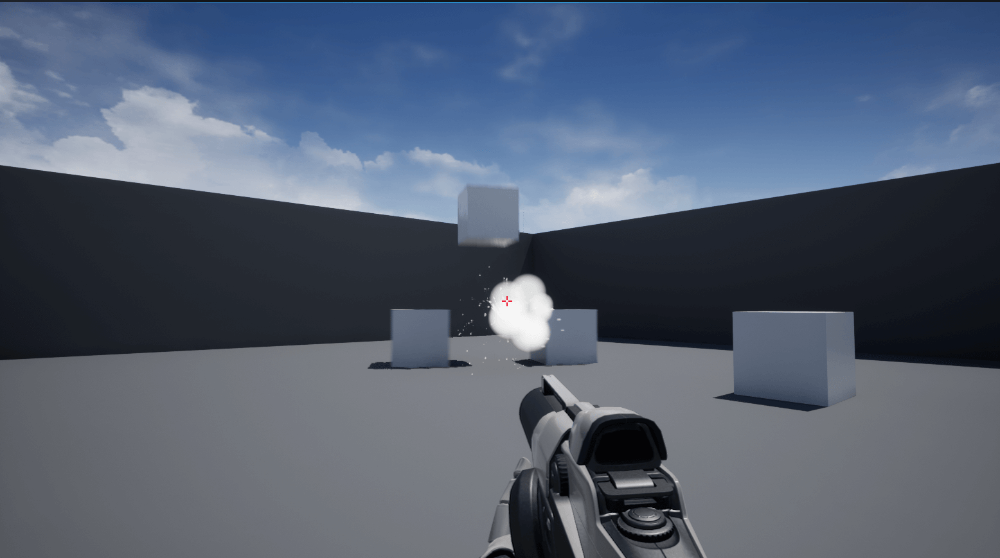

# Use a Radial Force Component to Turn the Projectile Into a Grenade
* Unreal Version: **5.0.0**
* Template: **First Person**
* Project Name: **MyProject**

1. Add Niagara to the Build.cs file
2. Create and add a Niagara System to the FirstPersonProjectile Blueprint after the code compiles. *Content->FirstPersonCPP->Blueprints->FirstPersonProjectile*. I use the simple explosion system for this example. *FX->Niagara System->Copy Existing System->Simple Explosion*.

## Helpful Links and Documentation

1. [Forum Thread for the Solution](https://answers.unrealengine.com/questions/354174/making-a-force-burst-in-c.html)
2. [URadialForceComponent](https://docs.unrealengine.com/4.26/en-US/API/Runtime/Engine/PhysicsEngine/URadialForceComponent/)
3. [ERadialImpulseFalloff](https://docs.unrealengine.com/4.26/en-US/API/Runtime/Engine/Engine/ERadialImpulseFalloff/)
4. [UNiagaraSystem](https://docs.unrealengine.com/4.26/en-US/API/Plugins/Niagara/UNiagaraSystem/)
5. [UNiagaraFunctionLibrary](https://docs.unrealengine.com/4.26/en-US/API/Plugins/Niagara/UNiagaraFunctionLibrary/)
6. [UNiagaraComponentPool](https://docs.unrealengine.com/4.26/en-US/API/Plugins/Niagara/UNiagaraComponentPool/)
