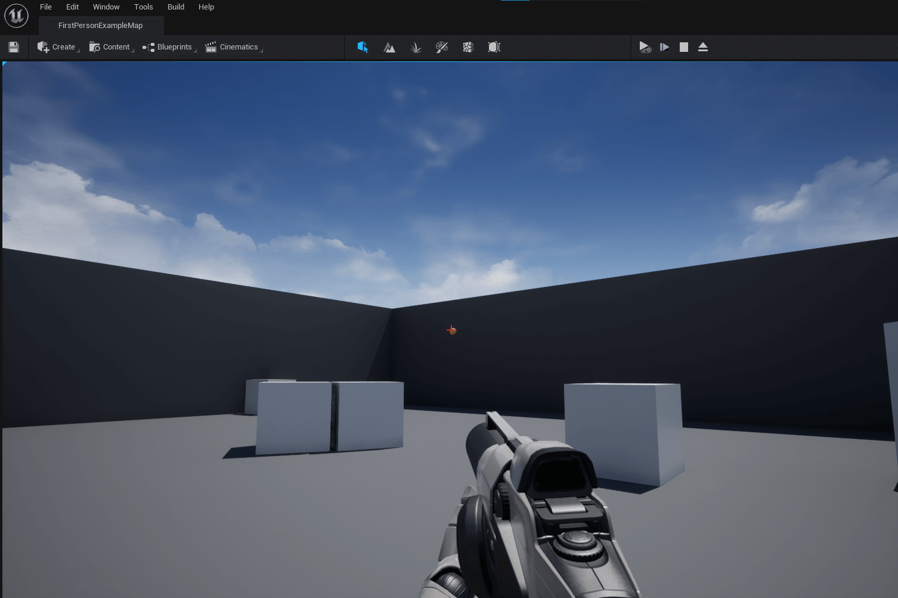
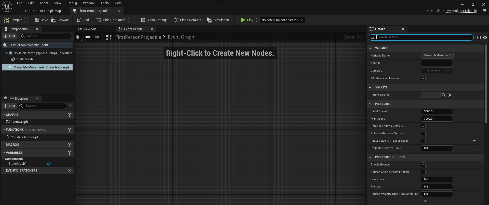

# Shoot Projectile Down the Center of the Crosshair

* Unreal Version: **5.0.0**
* Template: **First Person**
* Project Name: **MyProject**

**Big credit to the [Shooter Game Project](https://www.unrealengine.com/marketplace/en-US/item/fea72c38b29841e592f9ed2007a9d756). It's a wonderful learning resource. I just tried to split out the weapon fire projectile code and simplify it so I could better understand it.** 

1. Change *Projectile Gravity Scale* to `0` and set *Initial Velocity in Local Space* to `false`. Path: `Content/FirstPersonCPP/Blueprints/FirstPersonProjectile`

2. update the HUD.cpp file so the crosshair is in the center of screen. The crosshair texture is 16x16 so I adjusted it by 8 units in each direction on line 28. I think it's purposely off-center in the template to be more aligned with the yellow projectile, but I'm really not sure I could wrong.
3. update the projectile files with an `InitVelocity` function.

5. MyProjectCharacter.h - lines 141-148
6. MyProjectCharacter.cpp- lines 149-180, and lines 315-351. *you might have to include gameplay statics in your character file. I'm not sure, I didn't have to, I assume it's included by default. But if it throws an error, `#include "Kismet/GameplayStatics.h"` on line 14 might be necessary, but I can't confirm.*

## Helpful Links
* [Shooter Game](https://www.unrealengine.com/marketplace/en-US/item/fea72c38b29841e592f9ed2007a9d756)
* [Shoot Game Unreal Docs](https://docs.unrealengine.com/4.26/en-US/Resources/SampleGames/ShooterGame/)
* [LineTraceSingleByChannel](https://docs.unrealengine.com/4.26/en-US/API/Runtime/Engine/Engine/UWorld/LineTraceSingleByChannel/)
* [FCollisionQueryParams](https://docs.unrealengine.com/4.26/en-US/API/Runtime/Engine/FCollisionQueryParams/)
* [GetInstigatorController](https://docs.unrealengine.com/4.26/en-US/API/Runtime/Engine/GameFramework/AActor/GetInstigatorController/)
* [APlayerController](https://docs.unrealengine.com/4.26/en-US/API/Runtime/Engine/GameFramework/APlayerController/)
* [AController](https://docs.unrealengine.com/4.26/en-US/API/Runtime/Engine/GameFramework/AController/)
* [Instigator](https://docs.unrealengine.com/4.26/en-US/API/Runtime/Engine/Engine/FActorSpawnParameters/Instigator/)
* [GetPlayerViewPoint](https://docs.unrealengine.com/4.26/en-US/API/Runtime/Engine/GameFramework/APlayerController/GetPlayerViewPoint/)
* [FVector::DotProduct](https://docs.unrealengine.com/4.26/en-US/API/Runtime/Core/Math/FVector/DotProduct/)
* [FTransform](https://docs.unrealengine.com/4.26/en-US/API/Runtime/Core/Math/FTransform/)
* [BeginDeferredActorSpawnFromClass](https://docs.unrealengine.com/4.26/en-US/API/Runtime/Engine/Kismet/UGameplayStatics/BeginDeferredActorSpawnFromClass/)
* [FinishSpawningActor](https://docs.unrealengine.com/4.26/en-US/API/Runtime/Engine/Kismet/UGameplayStatics/FinishSpawningActor/)
* [UGameplayStatics](https://docs.unrealengine.com/4.26/en-US/API/Runtime/Engine/Kismet/UGameplayStatics/)
