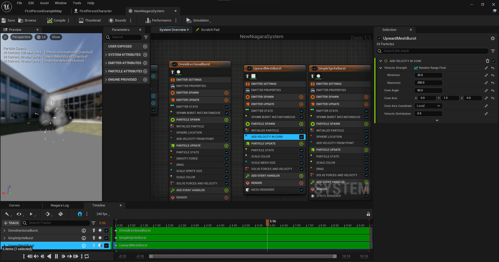
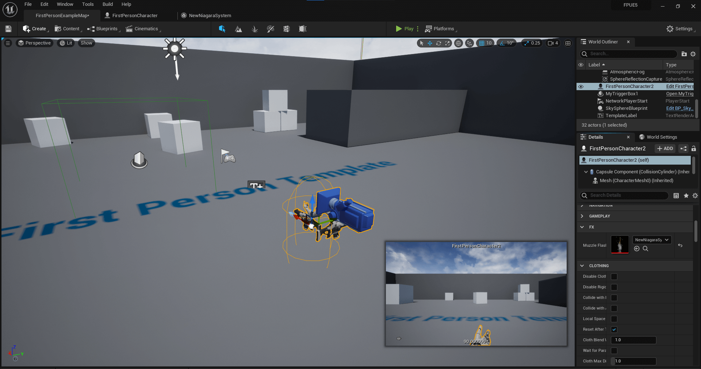

# Muzzle Flash Using SpawnSystemAtLocation

* Unreal Version: **5.0.0**
* Template: **First Person**
* Project Name: **FPUE5**

1. Add Niagara to your Build.cs file
2. I created a basic Niagara System using the Engine's default Simple Explosion template, but you can use whatever you want. *FX->Niagara System->Copy Existing System->Simple Explosion*. I then changed the velocity to be 0, 1, 0.

3. Add system to character after the code compiles.

## Notable Line Changes

**FPUE5Character.h**
* line 20
* lines 94-96

**FPUE5Character.cpp**
* lines 14-16
* lines 174-177

## Helpful Links
 
1. [Official UNiagaraSystem Docs](https://docs.unrealengine.com/4.26/en-US/API/Plugins/Niagara/UNiagaraSystem/)
2. [Official UNiagaraFunctionLibrary Docs](https://docs.unrealengine.com/4.26/en-US/API/Plugins/Niagara/UNiagaraFunctionLibrary/)
3. [Official UNiagaraComponentPool Docs](https://docs.unrealengine.com/4.26/en-US/API/Plugins/Niagara/UNiagaraComponentPool/)
3. [UE Forum Thread about spawning Niagaras](https://forums.unrealengine.com/t/trying-to-spawn-niagara-system-in-c-crashing/152182)
4. [UE Forum Thread regarding Niagara and Build.cs](https://forums.unrealengine.com/t/4-22-niagara-and-c/126475/8)
5. [Reddit Thread About Spawning Niagaras](https://www.reddit.com/r/unrealengine/comments/hfn7t9/are_there_any_c_usage_examples_of_the_niagara/)

