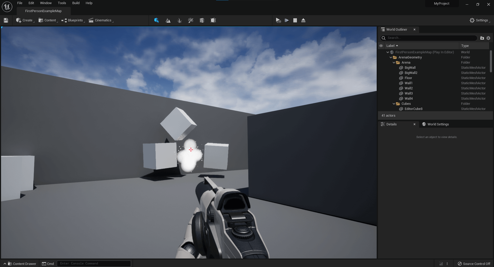

# Use SweepMultiByChannel to AddImpulseAtLocation to Create A Grenade Effect

* Unreal Version: **5.0.0**
* Template: **First Person**
* Project Name: **MyProject**

1. Optional: add Niagara to your Build.cs file to spawn an explosion on hit.
2. Optional: Create a simple Niagara explosion.
3. Optional: After code compiles add a sound effect and Niagara system to the projectile Blueprint. I added the Explosion01 Audio file from the Starter Content found here (*StarterContent/Audio/Explosion01*) and A Simple Explosion Niagara System I created in Step 2. The Projectile Blueprint can be found here *Content/FirstPersonCPP/Blueprints/FirstPersonProjectile*

## Helpful Links

* [FCollisionShape](https://docs.unrealengine.com/4.26/en-US/API/Runtime/PhysicsCore/FCollisionShape/)
* [FHitResult](https://docs.unrealengine.com/4.26/en-US/API/Runtime/Engine/Engine/FHitResult/)
* [TArray](https://docs.unrealengine.com/4.26/en-US/API/Runtime/Core/Containers/TArray/)
* [TArray Post](https://docs.unrealengine.com/4.26/en-US/ProgrammingAndScripting/ProgrammingWithCPP/UnrealArchitecture/TArrays/)
* [SweepMultiByChannel](https://docs.unrealengine.com/4.26/en-US/API/Runtime/Engine/Engine/UWorld/SweepMultiByChannel/)
* [Quaternion](https://docs.unrealengine.com/4.26/en-US/API/Runtime/Core/Math/FRotator/Quaternion/)
* [ECollisionChannel](https://docs.unrealengine.com/4.26/en-US/API/Runtime/Engine/Engine/ECollisionChannel/)
* [FCollisionQueryParams](https://docs.unrealengine.com/4.26/en-US/API/Runtime/Engine/FCollisionQueryParams/)
* [Helpful thread on how to ignore self on traces](https://forums.unrealengine.com/t/line-tracing-help-thank-you/6178)
* [Another Helpful thread on ignoring self](https://forums.unrealengine.com/t/ignore-self-with-sweeps/138875)
