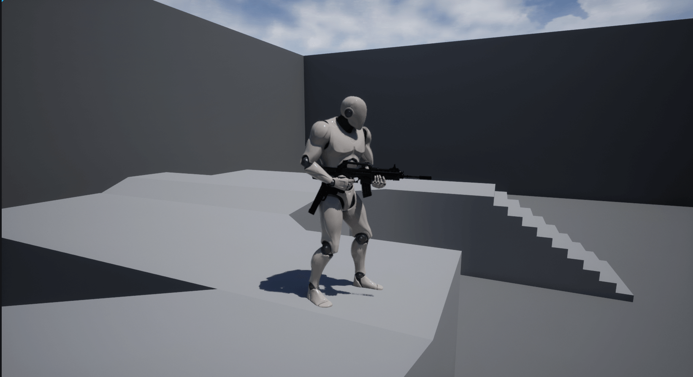
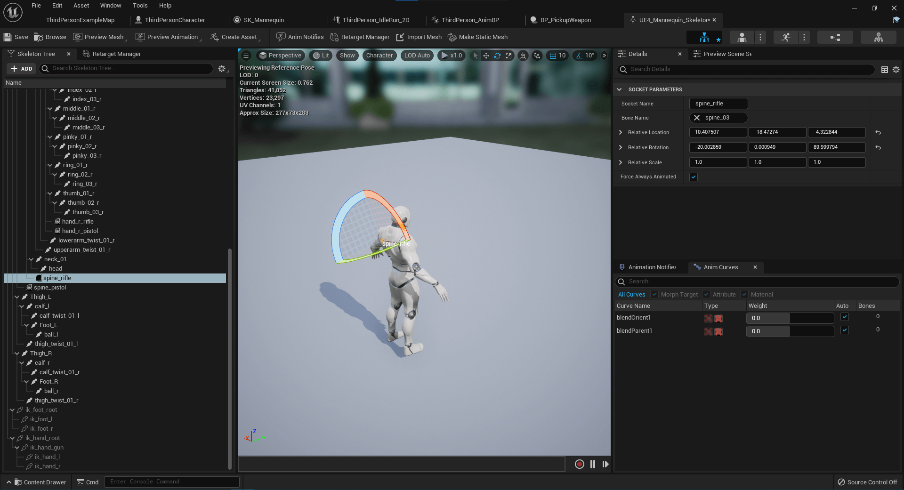
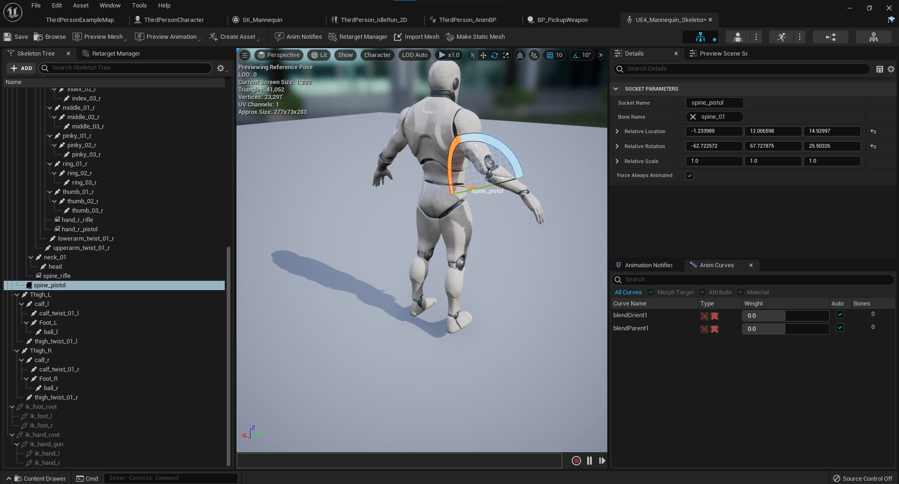
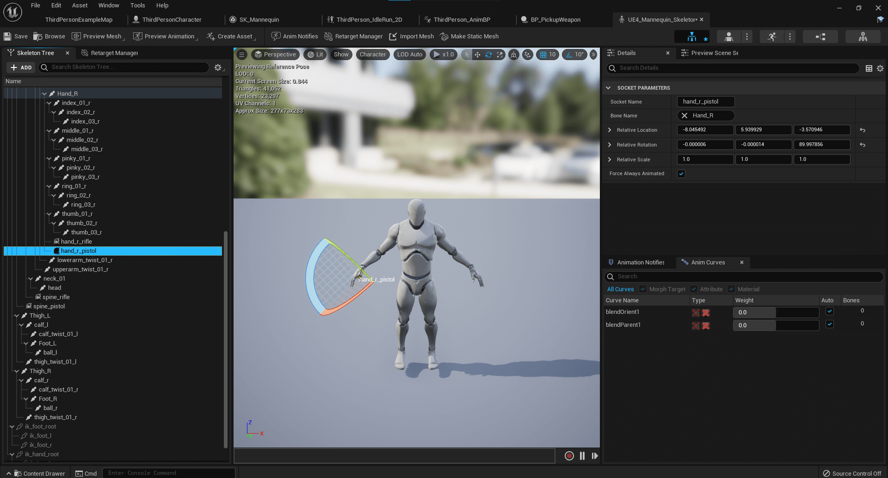
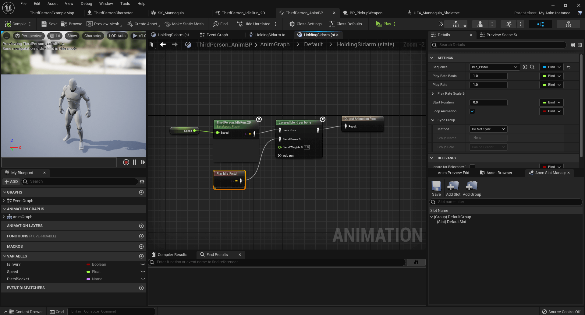
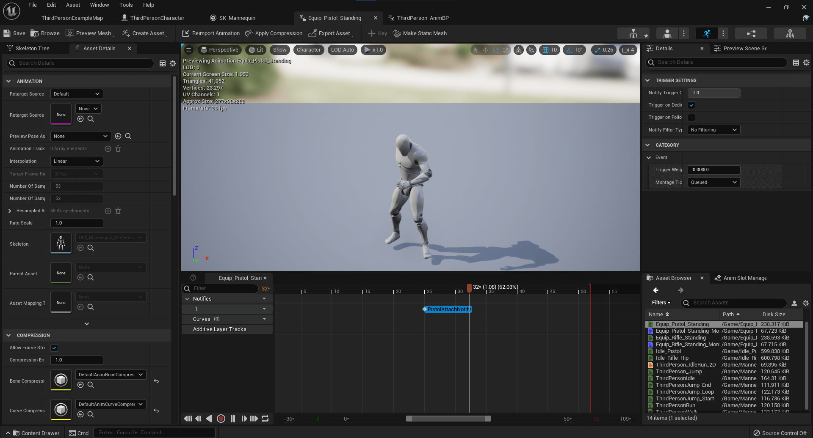
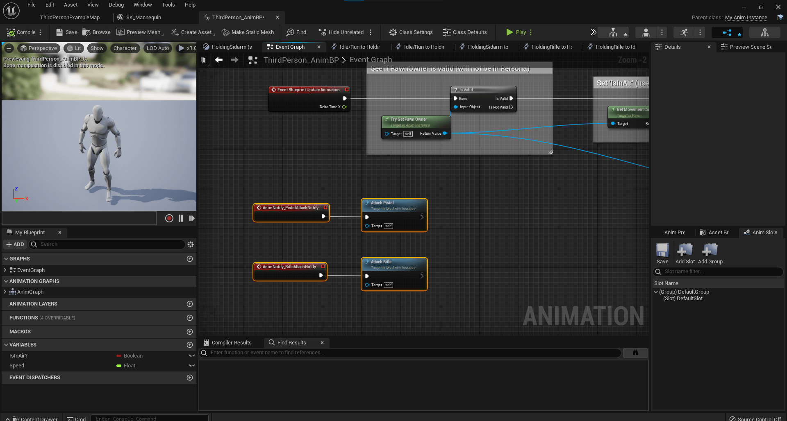

# Pick Up and Switch Weapons

* Unreal Version: **5.0.0**
* Template: **Third Person**
* Project Name: **MyProject**

This switching weapon example is a type of weapon structure where the character can only have one sidearm and one rifle at a time. When the player overlaps a weapon pickup the weapon will snap to the character and be added the players weapon map. This is not production ready code nor is it a perfect example of how a weapon system should work. 

There's dozens of ways to pick up and switch items, and mileage will vary depending on a game's needs. I'm sure there are better ways of doing this, but this was the way I construtcted it and I learned a lot throughout the process. There's a variety of different Engine and code features in this example touches so I figured it might help.

Add the marketplace items below to your project or add whatever assets you want. Each pack below should be free. When you click `Add To Project` in your Library's vault you'll probably need to click  `Show All Projects` then select your project then select the latest version the asset pack provides.

The animations don't line up exactly with what I was trying to do, but that's alright because it gets the point across.

1. Add [Animation Starter Pack](https://www.unrealengine.com/marketplace/en-US/product/animation-starter-pack) to project
2. Add [Military Weapons Dark](https://www.unrealengine.com/marketplace/en-US/product/military-weapons-dark) to project
3. Add Inputs 
4. Retarget Skeleton mesh to be able to get the idle pistol, idle rifle, equip pistol, and equip rifle animations.
5. Create montages of equip animations
6. Create new C++ class from AnimInstance called MyAnimInstance
7. Reparent Mannequin's AnimInstance parent class to MyAnimInstance
8. Create sockets to hold the guns
- Rifle Spine Socket

- Rifle Hand Socket

- Pistol Spine Socket

- Pistol Hand Socket

9. Update Anim Graph with layered animations. I layered the idle animations alternatively you can create animation blends

10. Update Animation Blueprint with nodes for isHoldingPistol and isHoldingRifle
11. Add AnimNotifies to the Equip Pistol and Equip Rifle animations at about half way through the animations 
12. Update Event Blueprint to fire the equip functions from the AnimInstance file. 
13. Create MyWeapon class
14. Create Data Table that uses the WeaponData Struct and add a pistol and rifle
15. Make Blueprint with parent PickupWeapon, add the row name and the data table variable and then drop them in the editor.

## Helpful Links

* [Unreal YouTube Montage Tutorial](https://www.youtube.com/watch?v=fkbftFEEmx8)
* [Another Unreal YouTube Montage Tutorial](https://www.youtube.com/watch?v=5DR7pxGouWE)
* [UStruct](https://docs.unrealengine.com/4.26/en-US/API/Runtime/CoreUObject/UObject/UStruct/)
* [TMap](https://docs.unrealengine.com/4.26/en-US/ProgrammingAndScripting/ProgrammingWithCPP/UnrealArchitecture/TMap/)
* [Rotating Movement Component](https://docs.unrealengine.com/4.26/en-US/API/Runtime/Engine/GameFramework/URotatingMovementComponent/)
